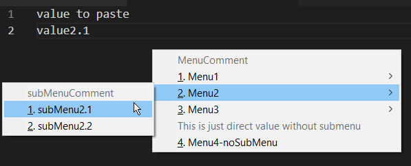

# ahKomplete
* custom "auto complete" context menu 
    - more like pick from custom list of options to paste
    - auto fill?
* 2 ways to use this 
    - ctrl + rclick - uses it at mouse cursor
    - alt + / - uses it where your typing highlight is
    - use on cursor or not is configurable for each method
    - you can change the hotkeys in code yourself


## description
* it just pastes the defined text
* custom data format
    - WHY?! 
        - didnt want to add libs for csv or json
        - didn't see ini working how i would want it to
        - wanted it to just work as simply as possible
    - Format:  
    ```Menu|SubMenu|Value|Options/```
    - delimiter |
    - end item /[newline]
        - because i end the item entry with a slash newline it has 3 effects:
            1. allows for multiline value
            2. allows for slashes in value as long as there isnt a newline right after the slash
            3. there has to be an empty newline at the end of the file   
    - options:
        - empty - just not put in anything for default behavoir
        - c - treats the line as comment - disabled item in the context menu
        - i - ignores the line for menu parsing - comment in the data file
            - needs to have

* if there is more than 10 items in Menu or SubMenu, number hotkey will cycle highlight through them and you have to confirm with enter the one you want
